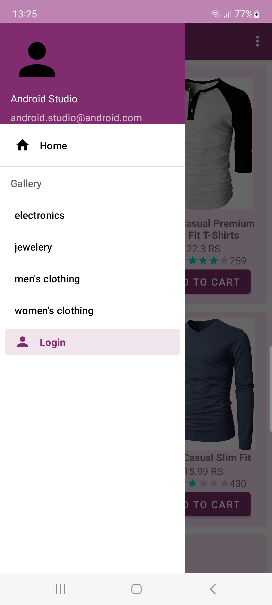
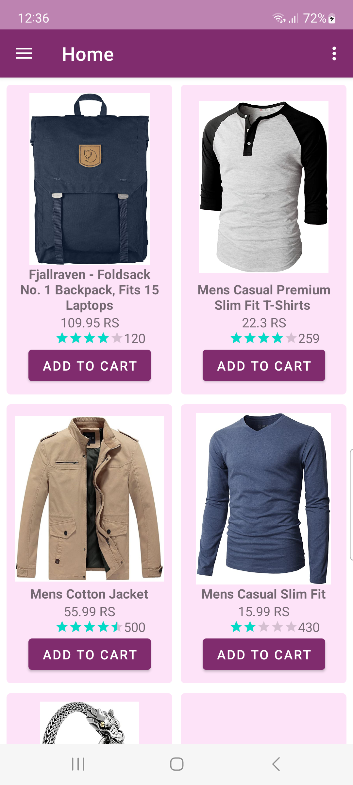
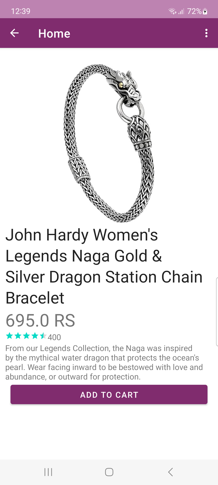
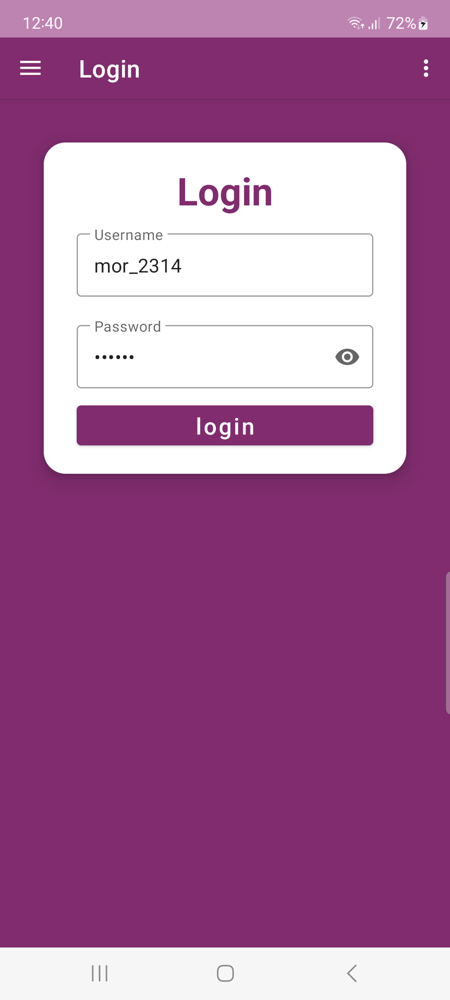

# Shop_app

Shop_app is an e-commerce app that features a simple filterable product list. You can login into existing user account. 
The Products data comes from the FakeStoreApi [Site](https://fakestoreapi.com/).

## Architecture

The app is structured using the Model-View-ViewModel (MVVM) pattern.
The Shop_app has a single activity that hosts all fragments while the Navigation component handles the fragment transactions.

## Screenshots

  
  
  
  

## Built With 🛠

- [ViewModel](https://developer.android.com/topic/libraries/architecture/viewmodel)
- [LiveData](https://developer.android.com/topic/libraries/architecture/livedata)
- [Navigation](https://developer.android.com/guide/navigation)
- [RecyclerView](https://developer.android.com/develop/ui/views/layout/recyclerview)
- [ViewBinding](https://developer.android.com/topic/libraries/view-binding)
- [Hilt Dependency Injection](https://dagger.dev/hilt/)
- [Retrofit](https://square.github.io/retrofit/)
- [Moshi](https://github.com/square/moshi/)
- [OkHttp](https://square.github.io/okhttp/)
- [Coroutines](https://kotlinlang.org/docs/coroutines-guide.html)
- [Flow](https://developer.android.com/kotlin/flow)
- [Glide](https://bumptech.github.io/glide/)
- [Facebook's shimmer effect](https://github.com/facebook/shimmer-android)

star ⭐ the repo it motivates me to share more open source

